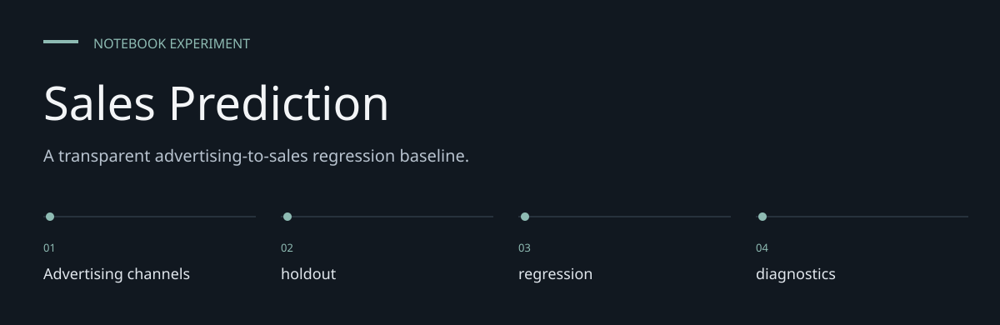
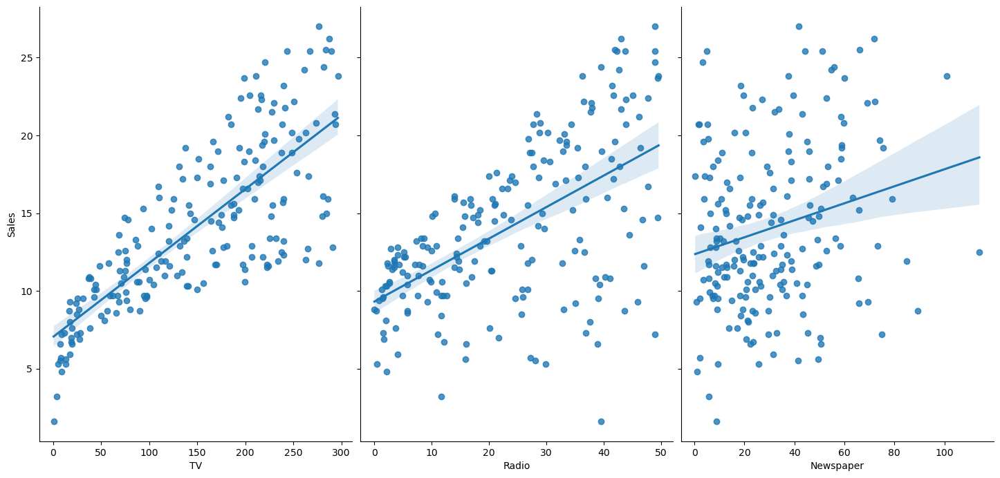

# Sales Prediction

**A transparent advertising-to-sales regression baseline.**

> A three-feature regression exercise with a recorded 160/40 train/test split.

[sales_prediction.ipynb](sales_prediction.ipynb) explores the relationship between TV, radio and
newspaper advertising inputs and sales, then fits a linear regression model. It provides pair plots,
summary statistics, held-out metrics and an actual-versus-predicted chart.


[Architecture](docs/ARCHITECTURE.md) · [Evaluation guide](docs/EVALUATION.md)

**Contents:** [The challenge](#the-challenge) · [Walkthrough](#walk-through-the-project) ·
[Implementation](#implementation-state) · [Design choices](#engineering-choices) ·
[Next evidence](#next-evidence-to-collect)

---

## The challenge

Advertising observations provide an approachable way to inspect the relationship between inputs
and Sales. This repository keeps that work in a notebook so preparation, computation and saved
outputs can be read together. Its value is an inspectable experiment, not a deployed prediction
service.



*Historical output embedded in [sales_prediction.ipynb](sales_prediction.ipynb), cell 7. Extracted
unchanged from the notebook; not a fresh experiment result.*

## System at a glance


## Walk through the project

### 1. Supply the input data

The required CSV files are not tracked. Obtain an authorized copy with the expected schema and
replace the author-specific absolute paths before execution.

### 2. Inspect the preparation

The split uses random_state=42 and a 20% holdout. Review the transformations and exclusions before
rerunning; an output cannot be understood separately from its input preparation.

### 3. Run the experiment

The implemented method is LinearRegression. Predictive association is not causal return on
advertising spend. Execute in a fresh kernel to reveal ordering and dependency problems.

### 4. Read the diagnostics

Saved holdout results show R² 0.899438 and mean squared error 3.174097 on 40 observations. The
source does not establish business units. No trained estimator artifact or prediction API is
supplied.

## Inspect and reproduce

Read the saved notebook outputs on GitHub, or execute with Python and Jupyter:

```sh
python3 -m venv .venv
.venv/bin/python -m pip install jupyterlab pandas matplotlib seaborn scikit-learn
.venv/bin/python -m jupyter lab sales_prediction.ipynb
```

The matching `Advertising.csv` is not included. Obtain it separately, replace the absolute path in
the `pd.read_csv` cell, and run from a clean kernel. Required columns are `TV`, `Radio`, `Newspaper`
and `Sales`; the displayed `Unnamed: 0` index column is not used as a model feature.
No dependency versions are locked, and dataset provenance/licensing is not documented here.

## Recorded experiment

| Stage | Implementation / saved evidence |
|---|---|
| Dataset | 200 rows shown in summary output |
| Inputs / target | TV, Radio, Newspaper / Sales |
| Split | 160 train, 40 test; `test_size=0.2`, `random_state=42` |
| Model | scikit-learn LinearRegression |
| MSE | 3.1740973540 |
| R² | 0.8994380241 |
| Visual checks | Pair plots and actual-versus-predicted scatter |

Workflow: `CSV → exploration → train/test split → regression fit → held-out metrics → chart`.
Numbers above are historical outputs inspected on **7 October 2026**. Execution was not repeated
because the CSV is absent. The notebook does not define monetary units or establish causal effects
of advertising expenditure.

## Scope and limits

This is a notebook experiment, with no serving API, fitted-model export, automated tests or
cross-validation study. A single split does not measure future campaign performance. The recorded
R² describes that test sample; it is not a guarantee or an advertising-budget recommendation.

## Engineering choices

**Inputs are explicit.** TV, Radio, Newspaper.

**Method is inspectable.** LinearRegression is the implemented method; no broader modeling
capability is inferred.

**Historical evidence is labeled.** Saved holdout results show R² 0.899438 and mean squared error
3.174097 on 40 observations. The source does not establish business units.

## Implementation state

| State | Current evidence |
| --- | --- |
| Present | Notebook source and historical saved outputs |
| Required externally | Authorized CSV input and compatible Python packages |
| Not rerun | Data-dependent execution in this documentation pass |
| Not supplied | Deployment service, model registry or automated behavior suite |

The [architecture guide](docs/ARCHITECTURE.md) maps these statements to source entry points.
The [evaluation guide](docs/EVALUATION.md) separates inspection, executable checks and
domain validation, with the next evidence needed for each project.

## Next evidence to collect

- Supply data provenance and a reproducible local path.
- Record a fresh-kernel run with package versions.
- Evaluate stability across independent samples before widening any performance claim.
